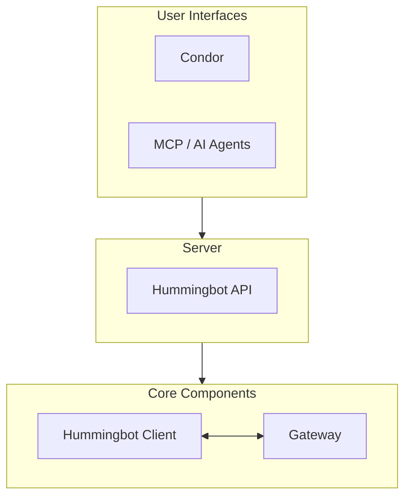
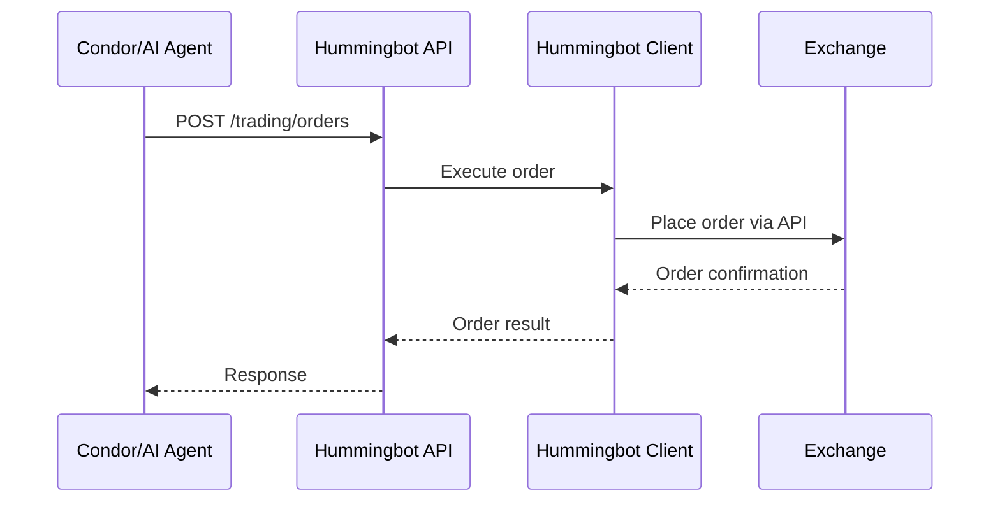

Hummingbot API is a RESTful server that provides programmatic access to the Hummingbot trading framework. It serves as the execution layer for Condor and other AI trading systems.

## System Architecture



## Components

### User Interfaces

| Component | Description |
|-----------|-------------|
| **Condor** | Telegram bot for mobile/desktop control of trading operations |
| **MCP / AI Agents** | Connect Claude, Gemini, GPT, or other LLMs to trading infrastructure |

### Server Layer

| Component | Description |
|-----------|-------------|
| **Hummingbot API** | FastAPI server providing REST endpoints for trading, data, and bot management |
| **PostgreSQL** | Stores orders, accounts, positions, and performance metrics |
| **EMQX** | Message broker enabling real-time communication with bot instances |

### Core Components

| Component | Description |
|-----------|-------------|
| **Hummingbot Client** | Core Python library with CEX connectors and trading strategies |
| **Gateway** | DEX middleware for Uniswap, Jupiter, Raydium, and 30+ DEXs |

## How It Works

1. **User Interfaces** (Condor, AI agents) send requests to the Hummingbot API
2. **Hummingbot API** processes requests and routes them to the appropriate component
3. **Hummingbot Client** handles CEX trading via exchange APIs
4. **Gateway** handles DEX trading via blockchain RPCs

## Deployment Options

### Development (Local)

Run everything on your local machine:

```bash
# Clone and start Hummingbot API
git clone https://github.com/hummingbot/hummingbot-api
cd hummingbot-api
make install
make run
```

### Production (Server)

Deploy on a cloud server with Docker:

- API server runs as a systemd service or Docker container
- Bots run as isolated Docker containers
- Gateway runs as a separate service for DEX access

## Data Flow



## Learn More

<CardGroup cols={2}>
  <Card title="Hummingbot" icon="robot" href="/api-reference/hummingbot">
    The core trading framework
  </Card>
  <Card title="Gateway" icon="shuffle" href="/api-reference/gateway">
    DEX middleware for decentralized trading
  </Card>
</CardGroup>
