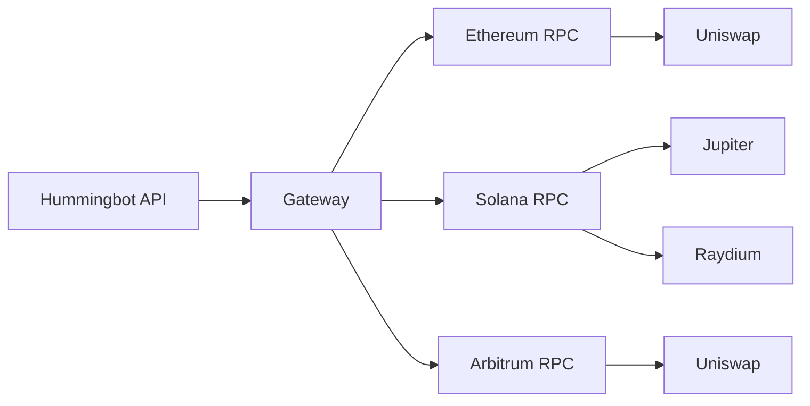

**Gateway** is DEX middleware that enables Hummingbot API to trade on decentralized exchanges. It provides a standardized interface to swap tokens, provide liquidity, and interact with DeFi protocols across multiple blockchains.

## What is Gateway?

Gateway is a separate service that:

- Connects to blockchain RPCs (Ethereum, Solana, etc.)
- Manages wallet keys and transaction signing
- Provides unified API for different DEX protocols
- Handles gas estimation and transaction submission



## Supported Protocols

### AMM Swaps

| Protocol | Chains |
|----------|--------|
| **Uniswap** | Ethereum, Arbitrum, Base, Polygon, Optimism |
| **Jupiter** | Solana |
| **Raydium** | Solana |
| **PancakeSwap** | BSC, Ethereum |
| **SushiSwap** | Ethereum, Arbitrum |
| **Orca** | Solana |
| **Curve** | Ethereum |
| **Balancer** | Ethereum, Arbitrum |

### CLMM (Concentrated Liquidity)

| Protocol | Chains |
|----------|--------|
| **Uniswap V3** | Ethereum, Arbitrum, Base, Polygon |
| **Raydium CLMM** | Solana |
| **Orca Whirlpools** | Solana |
| **PancakeSwap V3** | BSC, Ethereum |

### Supported Chains

| Chain | Type | RPC Required |
|-------|------|--------------|
| Ethereum | EVM | Yes |
| Arbitrum | EVM | Yes |
| Base | EVM | Yes |
| Polygon | EVM | Yes |
| Optimism | EVM | Yes |
| BSC | EVM | Yes |
| Solana | SVM | Yes |

## How Hummingbot API Uses Gateway

### Swaps

Execute token swaps via the `/gateway/swaps` endpoints:

```bash
# Get a swap quote
curl -u admin:admin -X POST http://localhost:8000/gateway/swaps/quote \
  -H "Content-Type: application/json" \
  -d '{
    "chain": "solana",
    "network": "mainnet",
    "connector": "jupiter",
    "base_token": "SOL",
    "quote_token": "USDC",
    "amount": "1.0",
    "side": "sell"
  }'

# Execute the swap
curl -u admin:admin -X POST http://localhost:8000/gateway/swaps/execute \
  -H "Content-Type: application/json" \
  -d '{
    "chain": "solana",
    "network": "mainnet",
    "connector": "jupiter",
    "base_token": "SOL",
    "quote_token": "USDC",
    "amount": "1.0",
    "side": "sell",
    "wallet_address": "your-wallet-address"
  }'
```

### Liquidity Provision

Manage CLMM positions via `/gateway/clmm` endpoints:

```bash
# Get pool information
curl -u admin:admin -X POST http://localhost:8000/gateway/clmm/pools \
  -H "Content-Type: application/json" \
  -d '{
    "chain": "solana",
    "network": "mainnet",
    "connector": "raydium",
    "token_a": "SOL",
    "token_b": "USDC"
  }'

# Add liquidity
curl -u admin:admin -X POST http://localhost:8000/gateway/clmm/add-liquidity \
  -H "Content-Type: application/json" \
  -d '{
    "chain": "solana",
    "network": "mainnet",
    "connector": "raydium",
    "pool_id": "pool-address",
    "wallet_address": "your-wallet",
    "amount_a": "1.0",
    "amount_b": "150.0",
    "lower_price": "140.0",
    "upper_price": "160.0"
  }'
```

## Setup

### 1. Configure Gateway

Gateway requires RPC endpoints and wallet configuration:

```yaml
# gateway/conf/gateway.yml
chains:
  solana:
    network: mainnet
    rpc_url: https://api.mainnet-beta.solana.com

  ethereum:
    network: mainnet
    rpc_url: https://eth-mainnet.g.alchemy.com/v2/YOUR_KEY
```

### 2. Add Wallets

Add wallet credentials via Condor or API:

**Telegram:**
```
/gateway → Add Wallet → Solana → Enter private key
```

**API:**
```bash
curl -u admin:admin -X POST http://localhost:8000/gateway/wallets/add \
  -H "Content-Type: application/json" \
  -d '{
    "chain": "solana",
    "private_key": "your-private-key"
  }'
```

### 3. Verify Connection

Check Gateway status:

```bash
curl -u admin:admin http://localhost:8000/gateway/status
```

## Gateway vs CEX Connectors

| Aspect | CEX Connectors | Gateway |
|--------|----------------|---------|
| **Custody** | Exchange holds funds | You hold keys |
| **Speed** | Fast (centralized) | Slower (blockchain) |
| **Fees** | Trading fees | Gas + trading fees |
| **Availability** | Exchange uptime | Blockchain uptime |
| **Privacy** | KYC required | Permissionless |

## Resources

<CardGroup cols={2}>
  <Card title="Gateway GitHub" icon="github" href="https://github.com/hummingbot/gateway">
    Gateway source code
  </Card>
  <Card title="Gateway Docs" icon="book" href="https://hummingbot.org/gateway/">
    Full Gateway documentation
  </Card>
</CardGroup>
